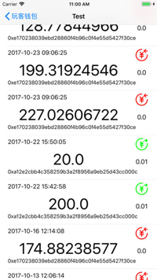

# 玩客/链克钱包 

     
    
    

## 关于

LKWallet 是一款迅雷玩客币（链克）查询和账户操作的第三方 App。

> App Store 地址:  [https://itunes.apple.com/cn/app/玩客钱包/id1302778851](https://itunes.apple.com/cn/app/%e7%8e%a9%e5%ae%a2%e9%92%b1%e5%8c%85/id1302778851)

## 截图

                        

## 编译

使用最新的 Cocoapods（version 1.3.1）和 Xcode 9.2 进行编译并运行。

- 首先，下载源代码：
  `git clone https://github.com/Tuluobo/LKWallet.git`

- 使用终端切换到项目目路，执行：
  `pod install`

  > 如果没有安装 `CocoaPods` 请 Google 安装。

- 打开 `LKWallet.xcworkspace` Build, Run。

## 功能 TODO

已完成功能：

- [x] 账户余额查询
- [x] 账户交易查询
- [x] 钱包文件导入
- [x] 钱包文件导出
- [x] 账户修改密码

待完善功能：

- [ ] 转账

## License

Apache-2.0
